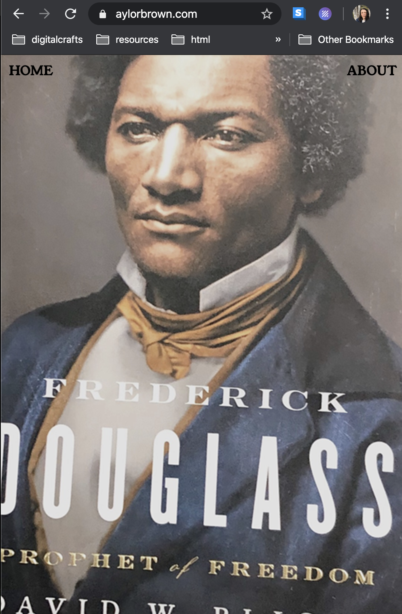

### Aylor Brown Portfolio 


## Challenges
I found a template that I like and reverse-engineered it, adding my own features like a sticky header and ---. 

The biggest development challenge was making the mobile site responsive and creating a div with a left and a right --. After watching a few tutorials, I made a parent section with two div children.

```html
<section class="container">
        <div class="left-half">
            <a href="adoptandchill.html"><h1>Adopt and Chill</h1></a>  
        </div>

        <div class="right-half">
            <a href="adoptandchill.html">
            
            </a>
        </div>
    </section>
```

I originally made the CSS ```display:block``` and ```left:0``` for the left div and ```right:0``` for the right div. This solution worked but the site was in laptop mode, but broke down in mobile. I switched to flex box and took out the ```left``` and ```right``` properties:

```css
section.container  {
    display: flex;
    width: 100%; 
}

div.left-half { 
    background-color: #c3a55c; 
    width: 50%;
    height: 100vh;
    overflow: hidden;
}

div.right-half { 
    background-color: #fbf591; 
    width: 50%;
    height: 100vh;
    overflow: hidden;

    display: flex;
    align-items: center;
    justify-content: center;
}
```
To make the images fill to the size of the container while keeping their aspect ration, I used:

```css
.img { 
    min-width: 100%; 
    min-height: 100%;
}
```

voila! The site is now mobile friendly! 




## What's Next
- Adding more projects 
- Adding a 'last updated' bar at the bottom of the page 
- Adding Javascript elements like a scroll bar at the top that tracks the scroll progress 
- Adding my resume using Canvas to create fun elements 

## Author 
[Aylor Brown](https://aylorbrown.com)
